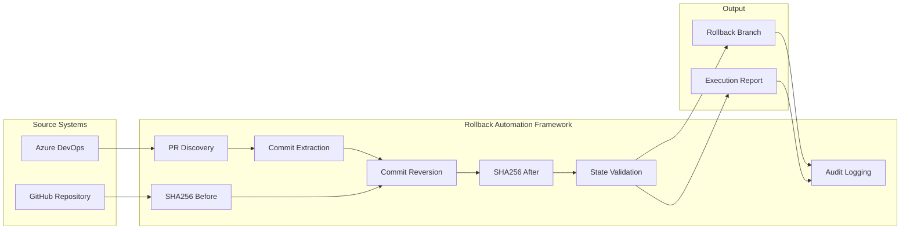
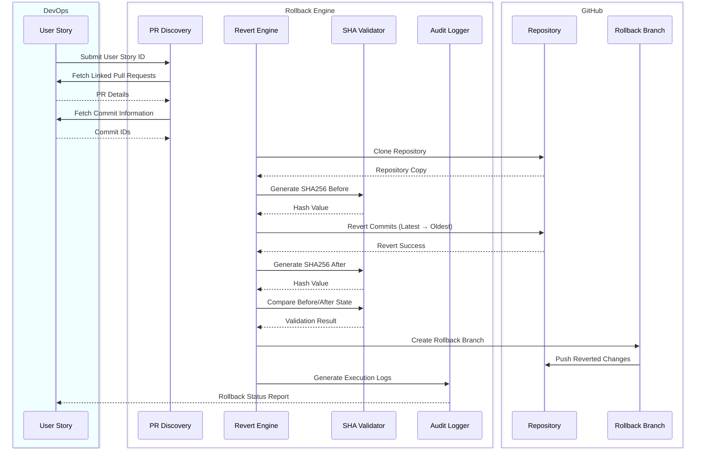

# Azure DevOps Automated Rollback Engine

## Overview

The Azure DevOps Automated Rollback Engine is a Python-based automation solution designed to identify, validate, and revert code changes associated with Azure DevOps User Stories.

The solution traces User Stories to linked Pull Requests, extracts associated commits, performs controlled Git revert operations, validates repository state using SHA-256 hashing, creates a dedicated rollback branch, and generates audit logs for complete traceability.

---

## Objective

The objective of this solution is to automate rollback activities by:

- Identifying Pull Requests linked to Azure DevOps User Stories
- Extracting associated commit IDs
- Reverting commits automatically
- Validating repository state using SHA-256
- Creating rollback branches
- Maintaining audit logs
- Reducing manual rollback effort

---
## Solution Architecture



---

## Sequence Diagram


---

## Technology Stack

| Component | Technology |
|------------|------------|
| Language | Python 3.x |
| Work Item Management | Azure DevOps |
| Source Control | GitHub |
| Version Control | Git |
| Validation | SHA-256 |
| Logging | Python Logging |
| Authentication | Azure DevOps PAT |
| APIs | Azure DevOps REST APIs |

---

## Workflow

### Step 1: Fetch User Story

Retrieve User Story details from Azure DevOps.

### Step 2: Discover Linked Pull Requests

Identify all Pull Requests associated with the User Story.

### Step 3: Extract Commit IDs

Collect commit IDs from linked Pull Requests.

### Step 4: Clone Repository

Clone the target GitHub repository locally.

### Step 5: Generate SHA256 Before Rollback

Generate repository fingerprint before making any modifications.

### Step 6: Revert Commits

Perform Git revert operations in reverse chronological order.

### Step 7: Generate SHA256 After Rollback

Generate repository fingerprint after rollback completion.

### Step 8: Validate Repository State

Compare repository hashes and validate rollback execution.

### Step 9: Create Rollback Branch

Create a dedicated rollback branch.

### Step 10: Push Changes

Push rollback changes to GitHub.

### Step 11: Generate Audit Logs

Capture execution details and rollback status.

---

## Features

### Azure DevOps Integration

- Fetch User Stories
- Discover linked Pull Requests
- Support multiple User Stories

### Commit Discovery

- Extract PR commit history
- Identify rollback candidates

### Automated Rollback

- Execute Git revert operations
- Preserve repository history
- Safe rollback execution

### SHA-256 Validation

- Generate pre-rollback hash
- Generate post-rollback hash
- Validate repository integrity

### Branch Management

- Create rollback branch
- Push rollback commits
- Maintain isolation from target branch

### Audit Logging

- Detailed execution logs
- Error tracking
- Rollback traceability

---

## Error Handling & Edge Cases

### 1. Consecutive Commits

**Scenario**

Multiple commits belong to the same feature implementation.

**Handling**

- Revert commits in reverse order
- Preserve dependency chain
- Maintain repository consistency

---

### 2. Non-Consecutive Commits

**Scenario**

User Story changes are spread across unrelated commits.

**Handling**

- Process commits individually
- Maintain rollback order
- Validate repository state after rollback

---

### 3. Merge Conflicts

**Scenario**

Rollback overlaps with newer code changes.

**Handling**

- Stop execution immediately
- Log conflict details
- Require manual intervention

---

### 4. Branch Not Found

**Scenario**

Target branch does not exist.

**Handling**

- Validate branch existence before execution
- Abort rollback safely

---

### 5. Pull Request Not Found

**Scenario**

User Story has no linked Pull Requests.

**Handling**

- Exit gracefully
- Log validation failure

---

### 6. Commit Not Found

**Scenario**

Commit referenced by Pull Request is unavailable.

**Handling**

- Validate commit existence
- Skip processing and log error

---

### 7. Repository Access Failure

**Scenario**

GitHub clone or authentication failure.

**Handling**

- Stop execution
- Capture detailed error logs

---

## Sample Execution Flow

```text
========== PIPELINE STARTED ==========

Work Item ID: 14

Pull Requests Found: 2

Commits Identified:
a12b34c
d45e67f

SHA256 Before:
7f6a8e9d...

Reverting Commit:
d45e67f

Reverting Commit:
a12b34c

SHA256 After:
4d9e1f2a...

Repository Validation:
SUCCESS

Rollback Branch Created:
rollback-US14

Changes Pushed Successfully

========== PIPELINE COMPLETED ==========
```

---

## Benefits

- Automated rollback execution
- Reduced recovery time
- Improved deployment reliability
- Complete auditability
- Repository integrity validation
- Reduced manual effort
- Scalable rollback process

=======
---

## Project Status

### Current POC Scope

✅ Azure DevOps User Story Integration

✅ Pull Request Discovery

✅ Commit Extraction

✅ Git Revert Automation

✅ SHA-256 Validation

✅ Rollback Branch Creation

✅ GitHub Push Automation

✅ Audit Logging

✅ Common Error Handling

---

## Author

**Veeresh**
